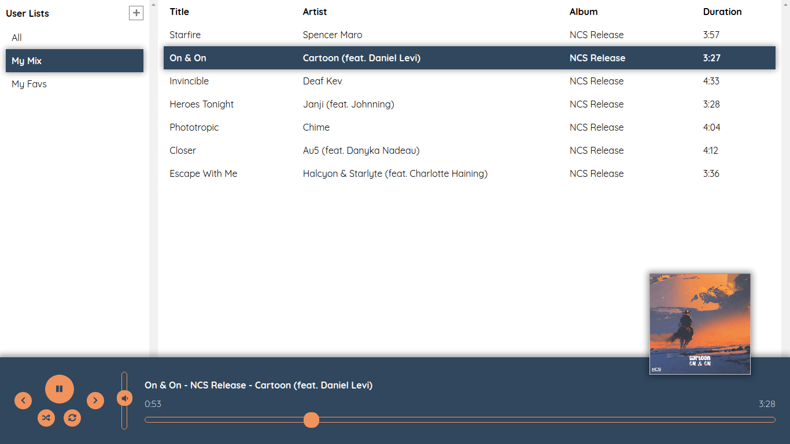

# A web music player



#### (bugs/ui is being fixed/updated & new features may be added)

---
I deployed the project to [Heroku](https://heroku.com/). You can try it. But currently, there is not a user based system so anyone can see other's actions (CRUD play list, add/remove music from play list, etc.)   :)
[Demo App](https://xlr-wmp.herokuapp.com/)

---
A web music player that have built with [ReactJS](http://reactjs.org/) and [ExpressJS](https://expressjs.com/). The project uses [MongoDB](https://www.mongodb.com/) for data storage. You need to import the data from *back-end/data/* to their corresponding collections. Also you need to create *play_lists* collection.

---
Frontend:
- [ReactJS](http://reactjs.org/)
- [Webpack](https://webpack.js.org/)
- [Babel](https://babeljs.io/)
- [Fontawesome for react](https://fontawesome.com/how-to-use/on-the-web/using-with/react)

Backend:
- [ExpressJS](https://expressjs.com/)
- [MongoDB](https://www.mongodb.com/)

---
The project features:
- Standard music player actions:
	- Play
	- Pause
	- Volume
	- Seek
	- Go next/prev music
	- Shuffle play list
	- Loop play list
- Creating playlist
- Deleting playlist *(right click on playlist)*
- Adding music to playlist *(right click on music)*
- Deleting music from playlist *(right click on music)*

---
To run the back-end project:
Copy the *db-config-exp.js* file as *db-config.js* and edit its content for your credentials and info. Then locate to *back-end/* folder and run the followings.
```
npm install
npm run dev-server
```

---
To run the front-end project:
Locate to *front-end/* folder and run the followings.
```
npm install
npm run dev-server
```
